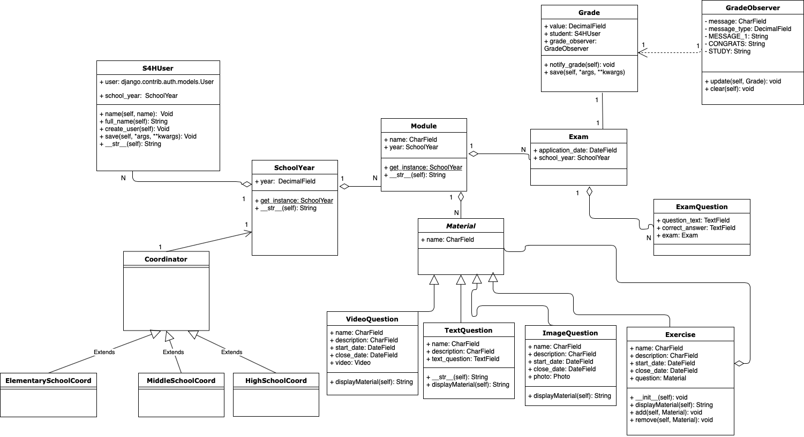
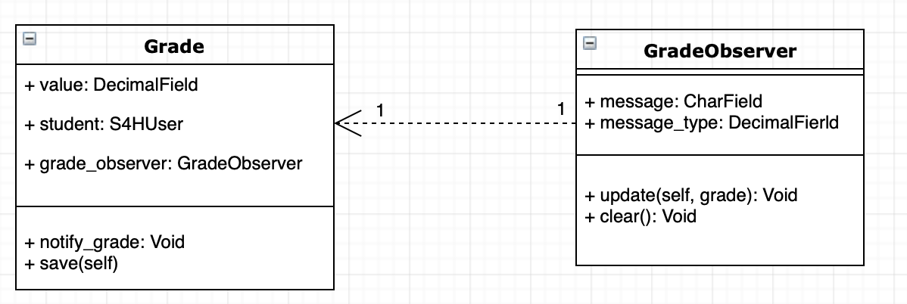
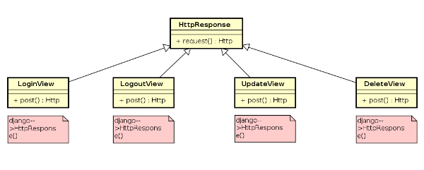

# Diagrama de Classe

Diagrama de Classes v1

Diagrama de Classes v1.1

Diagrama de Classes v1.2

# GRASPS

## Creator

Esse padrão ocorre, por exemplo, na classe S4HUser, de maneira que a model criada utiliza um objeto da classe User do Django, de maneira a aproveitar métodos e atributos já desenvolvidos por ela.

## Polimorfismo

Esse padrão ocorre, por exemplo, na variação das classes filhas da classe Material.

## Fabricação Pura

Esse padrão ocorre, por exemplo, na classe de GradeObserver. No mundo real, não há algo exato que represente o aguardar por uma nova nota para notificar o usuário. A classe foi criada para realizar essa atividade, sendo uma fabricação pura do projeto.

# GOF's

## Observer

Esse padrão ocorre no envio de mensagens sobre uma nova nota. Sempre que o aluno recebe uma nova nota, ele é notificado sobre ela. Devido ao contexto da tecnologia Python Django, adaptações foram necessárias.

## Multiton

Esse padrão ocorre nas instâncias de SchoolYear (Série) e Module (Matéria). Isso acontece porque existe um número limitado de séries e de matérias relacionadas a ela, que já sabido desde o lançamento da aplicação. Portanto, a permissão que novos objetos sejam feitos não é necessária. Logo, os objetos são salvos em uma fixture do aplicativo no Django.

## Composite
  

      ### Hot Spots (Laranja)
    Hot spots são partes genéricas do framework, que são adaptadas a partir da necessidade, sua reutilização acontece principalmente por herança e padrões de projetos.
    
## Command

Esse padrão ocorre a partir da maneira que as requisições são tratadas no Django e consequentemente no projeto. A partir da classe HttpRequest, as requisições são tratadas sem saber a operação requisitada ou quem receberá ela.

