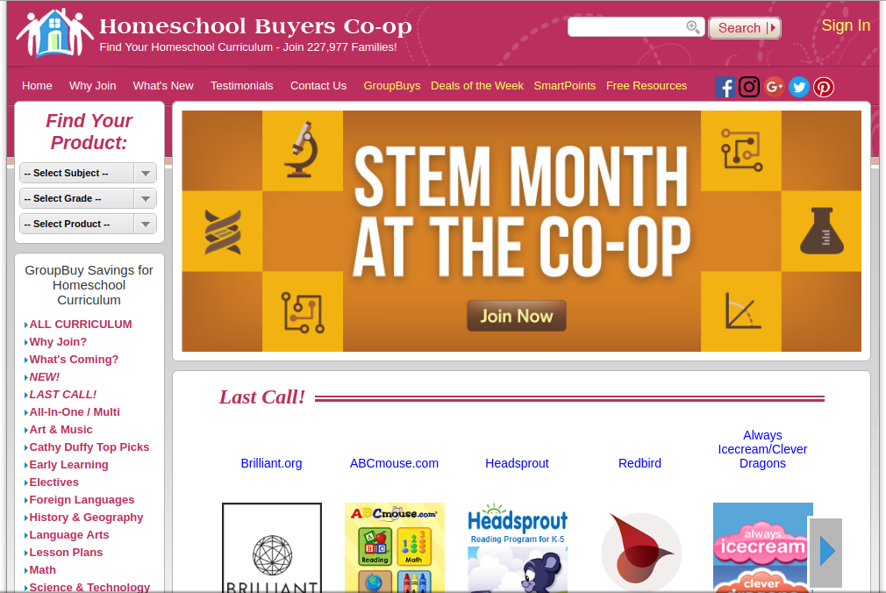

# Documento de Visão

Histórico de Revisão

| Data | Versão | Descrição | Autor\(res\) |
| :--- | :--- | :--- | :--- |
| 31/08/2018 | 1.0 | Introdução, Oportunidade de Negócio | Thiago Ribeiro |
| 03/09/2018 | 2.0 | Posicionamento | Thiago Ribeiro |
| 17/09/2018 | 3.0 | Usuário, Envolvidos e Visão Geral do Produto | Thiago Ribeiro |

## Índice

### 1. Introdução 

1.1 Objetivos

1.2 Escopo

1.3 Visão geral do documento

1.4 Referências

### 2. Posicionamento 

2.1 Oportunidade de Negócios

2.2 Descrição do problema

2.3 Sentença de Posição do Produto

### 3. Descrição do usuário 

3.1 Usuário

3.2 Principais necessidades do usuário

3.3 Ambiente do usuário

3.4 Alternativas e competição

### 4. Envolvidos 

### 5. Visão geral do produto 

5.1 Perspectiva do produto

5.2 Recursos do produto

## 1. Introdução

### 1.1 Objetivos 

O objetivo deste documento é explicar e esclarecer a respeito do escopo do projeto, auxiliando os desenvolvedores e leitores a entender a proposta do produto e também é objetivo deste documento introduzir o posicionamento do software frente ao problema a se solucionar, aos seus usuário e ao público em que se encontra.

### 1.2 Escopo 

Atualmente existe um grande debate no que diz respeito a qual modelo educacional é o mais ideal para os estudantes. Uns julgam que a educação familiar é o modelo mais adequado e por outro lado muitos consideram a educação tradicional, no qual o aluno deve ir para a escola, se inserir em turmas com outros alunos e aprender com um professor seja o melhor modelo educacional. Diante desse quadro e mais alguns aspectos que serão melhor elaborados no restante do documento, o School4Home busca ser uma plataforma para auxiliar as pessoas que preferem o ensino doméstico, ferramenta que concederá um suporte educacional aos pais e/ou tutores e aos respectivos alunos em suas casas.

### 1.3 Visão Geral do Documento 

Este documento contém detalhes a respeito das características do sistema a ser desenvolvido, esclarecendo os problemas que se busca mitigar e como as soluções propostas atendem a esses requisitos. A organização deste documento se dá da seguinte maneira: inicialmente estão esclarecidas as razões que influenciaram o desenvolvimento da aplicação, assim como a descrição dos envolvidos. E por fim são descritos os recursos do produto e suas funcionalidades.

### 1.4 Referências 

Não possuímos referencia atualmente no Brasil, entretanto temos várias referencias pelo mundo.

Encontradas através desse [artigo](https://www.homeschool.com/articles/top100_2017) que busca elicitar os melhores sites educacionais:

**Big Whirled** &lt;[https://bigwhirled.com/](https://bigwhirled.com/)/&gt; Acesso em: 31/08/2018

**Homeschool.com** &lt;[www.homeschool.com](https://github.com/school4home/S4h-docs/tree/bd26c81e5d530d0d0cf6730f9ebcef154b24ef2e/documentacao/www.homeschool.com)&gt; Acesso em: 31/08/2018

**4Knowledge-4Fun** &lt;[www.4knowledge-4fun.com](www.4knowledge-4fun.com)&gt; Acesso em: 31/08/2018

**Homeschool Buyers Co-op** &lt;[www.homeschoolbuyersco-op.org](https://github.com/school4home/S4h-docs/tree/bd26c81e5d530d0d0cf6730f9ebcef154b24ef2e/documentacao/www.homeschoolbuyersco-op.org)&gt; Acesso em: 31/08/2018

## 2. Posicionamento 

### 2.1 Oportunidade de Negócios 

Diante de alguns problemas ou preferencias encontrados no contexto educacional, a School4Home busca ser uma boa opção para solucionar ou evitar os mesmos.

**Obs**: _Foi encontrado um público que sente esses problemas e a sua análise de negócio deve ser realizada desassociada a posicionamento no que diz respeito a posse de arma, posição politica e cosmovisão de gênero._

**School shooting:** Um school shooting \(tiroteio na escola\) é um ataque a uma instituição educacional, como uma escola ou universidade, envolvendo o uso de arma \(s\) de fogo.

**Polarização política:** Existe extremos políticos que são muitas vezes opostos no qual professores e pais recorrentemente divergem, logo, os alunos estão frequentemente expostos a professores que doutrinam os alunos de uma maneira discordante ao ensino dos pais.

**Relativização do gênero:** Aquilo que identifica e diferencia homens e mulheres está sendo relativizado em algumas escolas e isso embora agrade uma parcela, desagrada outra.

**Mobilidade** **:** Alunos que viajam frequentemente, seja por ser atletas ou por possuir pais que viajam a negócios, fatalmente convivem com o problema de estar sempre se matriculando em uma nova escola no qual implica muitas vezes no mal desempenho do aluno.

### 2.2 Descrição do Problema 

| **O problema** seria | A ausência de uma plataforma para auxiliar o ensino doméstico |
| :--- | :--- |
| **que afeta** | Pais, tutores e alunos dos mesmos |
| **cujo impacto é** | um desgaste dos pais e tutores na capacitação técnica e um eventual ensino não qualificado |
| **e uma boa solução seria** | uma plataforma no qual permite e auxilie os pais e tutores no ensino doméstico disponibilizando um conteúdo elaborado por profissionais altamente qualificados |

### 2.3 Sentença de Posição do Produto 

| **Para** | os pais e tutores que realizam homeschooling |
| :--- | :--- |
| **que** | estão interessados em encontrar uma maneira mais fácil, adequada e mais qualificada de ensinar seus alunos |
| **o school4home** | é uma plataforma |
| **que** | auxilia o ensino domiciliar |
| **diferente de** | uma educação domiciliar tradicional no qual o ensino depende tão somente da capacitação técnica dos pais e tutores |
| **nosso produto** | oferece uma maneira de ensinar os alunos com o auxilio de uma plataforma para o melhor desenvolvimento do aluno. |

## 3. Descrição dos Envolvidos e dos Usuários 

### 3.1 Descrição dos envolvidos

| Nome | Descrição | Responsabilidade |
| :--- | :--- | :--- |
| Equipe de Desenvolvimento | Estudantes da Universidade de Brasília da disciplina de Arquitetura e Desenho de Software | Desenvolver, implementar e implantar o software descrito neste documento |

### 3.2 Usuário 

| **Nome** | **Descrição** | **Responsabilidades** |
| :--- | :--- | :--- |
| Clientes | Pais\(ou responsável\) e alunos interessados em adquirir um auxilio no homeschooling. | Utilizar a plataforma de maneira diligente |

### **3.3 Principais necessidades do usuário**

| **Necessidade** | **Problema** | **Solução Proposta** | **Solução Atual** |
| :--- | :--- | :--- | :--- |
| O cliente tem a necessidade de um auxilio/suporte no ensino doméstico | A dificuldade de aplicar o homeschooling clássico no qual exige muitas vezes do tutor um desgaste para compreender todo o conteúdo com propriedade | Um sistema web no qual o cliente pode desfrutar de uma plataforma para o apoio ao ensino doméstico | O cliente pode ensinar presencialmente, convidar pessoas voluntárias ou contratar professores particulares |

### **3.4 Ambiente do usuário**

A plataforma deve ser acessada a partir de um dispositivo conectado a internet, utilizando um navegador. A experiência do usuário deve ser semelhante em qualquer que seja o dispositivo, entretanto pode sofrer impacto pela velocidade da internet.

### 3.5 Alternativas e Competição

No momento, não há competição no Brasil e possuímos tão somente as nossas referencias estrangeiras como alternativas.

**3.5.1 Homeschool Buyers Co-op**

## 4. Envolvidos 

| **NOME** | **DESCRIÇÃO** | **PRINCIPAIS RESPONSABILIDADES** |
| :--- | :--- | :--- |
| Cauê Mateus | Membro da equipe de desenvolvimento | Executar o projeto, além de desenvolver e manter a documentação e o software. |
| Caio Felipe | Membro da equipe de desenvolvimento. | Executar o projeto, além de desenvolver e manter a documentação e o software. |
| Emanoel Belchior | Membro da equipe de desenvolvimento. | Executar o projeto, além de desenvolver e manter a documentação e o software. |
| Guilherme da Luz | Membro da equipe de desenvolvimento. | Executar o projeto, além de desenvolver e manter a documentação e o software. |
| Gustavo Braz | Membro da equipe de desenvolvimento. | Executar o projeto, além de desenvolver e manter a documentação e o software. |
| Thiago Ribeiro | Membro da equipe de desenvolvimento. | Executar o projeto, além de desenvolver e manter a documentação e o software. |
| Victor Leite | Membro da equipe de desenvolvimento. | Executar o projeto, além de desenvolver e manter a documentação e o software. |
| Vitor Menezes | Membro da equipe de desenvolvimento. | Executar o projeto, além de desenvolver e manter a documentação e o software. |
| Weyler Almeida | Membro da equipe de desenvolvimento. | Executar o projeto, além de desenvolver e manter a documentação e o software. |
| Profª. Milene Serrano | Orientadora e Avaliadora do Projeto | Acompanhar, avaliar e orientar o desenvolvimento do projeto. |

## 5. Visão geral do Produto 

### 5.1 Perspectiva do produto 

O School4Home tem como objetivo proporcionar um suporte ao ensino doméstico que possibilita tanto vantagens aos responsáveis pelo ensino quanto para o aluno durante sua jornada estudantil.

### 5.2 Recursos do produto 

* Exposição de conteúdos: Possibilita que o usuário tenha contato com conteúdos em textos, videos e questões nos quais serão produzidos com didática e clareza, feito por professores altamente qualificados.
* Sugestões de trilhas: Conceder e indicar possíveis trilhas para percorrer determinada sequencia de conteúdo no qual o aluno poderá se submeter.

